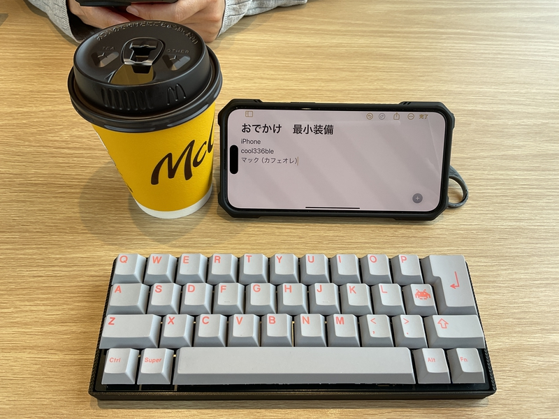
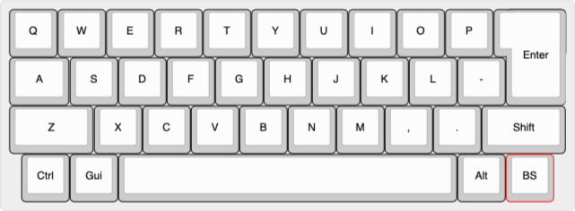

# cool336ble

## What is cool336ble?

Do you have an unused ISO enter key or 7U space key in a corner of your room?
 
部屋の隅に未使用の ISO エンターキーや 7U スペースキーはありませんか?
 
 
cool336ble is qaz layout keyboard.
 
cool336bleはqaz配列のキーボードです。
  
cool336ble has a iso enter key and 7U long space key.
 
cool336ble には ISO Enter キーと 7U の長いスペースキーがあります。
 
 
This keyboard use Pro micro or BLE Micro Pro, run qmk_firmware.
 
このキーボードは Pro micro または BLE Micro Pro を使用し、qmk_firmware を実行します。
 
With this keyboard, you can edit your favorite keymap using vial.
 
このキーボードでは、vialを使用してお気に入りのキーマップを編集できます。

# Layout

Keycap:1U x 31, 1.25U x 1, 1.75U x 2, 7U x 1, ISOkey x 1

## How to get keycaps?

https://yuzukeycaps.com/keyboards/cool336ble

## firmware

https://github.com/telzo2000/cool336ble/tree/main/firmware

## Build guide

https://github.com/telzo2000/cool336ble/blob/main/buildguide_for_cool336ble.md

## Parts list

| No. | Patrs | Quantity | remarks | Suppliers | Cost |
|--|--|--|--|--|--|
|番号|名前|数|備考|調達先|参考価格（送料込）| 
|1|PCB|1|36key|[elecrow](https://www.elecrow.com) [JLCPCB](https://jlcpcb.com) [ALLPCB](https://www.allpcb.com)|５枚で20〜30ドル| 
|2|BLE Micro Pro|1|MCU Board|[遊舎工房](https://shop.yushakobo.jp/products/ble-micro-pro?variant=37665571340449)|4950円|
|3|Swith socket スイッチソケット|36|cherry MX互換|[遊舎工房](https://yushakobo.jp) [Talp Keyboard](https://talpkeyboard.net) [Daily Craft Keyboard](https://shop.dailycraft.jp)等|10個で165円程度|
|4|Diode ダイオード|36|リードタイプでもSMDでも可|[遊舎工房](https://yushakobo.jp) [Talp Keyboard](https://talpkeyboard.net) [Daily Craft Keyboard](https://shop.dailycraft.jp)等|100個で220円程度から|
|5a|Switch plate|1|FR-4|[elecrow](https://www.elecrow.com) [JLCPCB](https://jlcpcb.com) [ALLPCB](https://www.allpcb.com)|５枚で20〜30ドル|
|5b|Switch plate|1|3D Print|||
|5c|Switch plate|1|Acrylic|[elecrow](https://www.elecrow.com/acrylic-cutting.html)|5枚で９ドル程度（送料込み）|
|6|Bottom case|1|3D Print||
|7|Screw ネジ|8|M2 6mm|DIY shop|10本200円程度|
|8|Spacer スペーサー|4|M2 6mm|DIY shop|10本400円程度|
|9|Stabilizer スタビライザー|2|2Ux1,7Ux1|[遊舎工房](https://yushakobo.jp) [Talp Keyboard](https://talpkeyboard.net)|セットで2000円程度|
|10|Conthrou コンスルー|2|3.5mm|[遊舎工房](https://yushakobo.jp) [Talp Keyboard](https://talpkeyboard.net)|１個400円程度|
|11|Keyswitch キースイッチ|36|お好みで|[遊舎工房](https://yushakobo.jp) [Talp Keyboard](https://talpkeyboard.net) [Daily Craft Keyboard](https://shop.dailycraft.jp)|１個100程度|
|12|Keycap キーキャップ|36|1Ux31、1.25Ux2、1.75Ux2、7Ux1|[遊舎工房](https://yushakobo.jp) [Talp Keyboard](https://talpkeyboard.net) [Daily Craft Keyboard](https://shop.dailycraft.jp)||
|13|ボタン電池ホルダー|1|1632|[アリエク](https://ja.aliexpress.com/item/32744211091.html?spm=a2g0o.order_list.order_list_main.10.2aa6585aqrECYV&gatewayAdapt=glo2jpn) |100個で900円ほど|
|14|水平スライドスイッチ|1||[遊舎工房](https://shop.yushakobo.jp/products/5624?_pos=1&_sid=f65b70e3c&_ss=r)|110円|
|15|チップ積層セラミックコンデンサー |1|100μF6.3V F 3216|[秋月電子](https://akizukidenshi.com/catalog/g/g102151/)|10個入り200円|

※13,14,15は[遊舎工房の「Primer29/61用電池部品セット（コイン電池」](https://shop.yushakobo.jp/products/5623)が最適。

 
In addition, you will need a USB cable, etc.
 
この他に、USBケーブル等が必要です。
 
