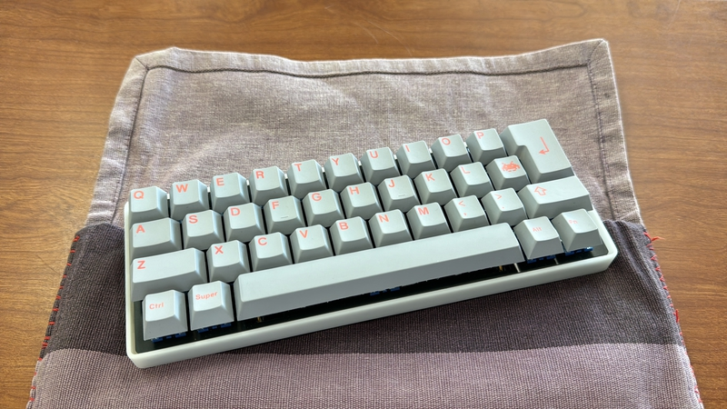

# cool336ble

## What is cool336ble?

Do you have an unused ISO enter key or 7U space key in a corner of your room?
 
部屋の隅に未使用の ISO エンターキーや 7U スペースキーはありませんか?
 
 
cool336ble is qaz layout keyboard.
 
cool336bleはqaz配列のキーボードです。
  
cool336ble has a iso enter key and 7U long space key.
 
cool336ble には ISO Enter キーと 7U の長いスペースキーがあります。
 
 
This keyboard use Pro micro or BLE Micro Pro, run qmk_firmware.
 
このキーボードは Pro micro または BLE Micro Pro を使用し、qmk_firmware を実行します。
 
With this keyboard, you can edit your favorite keymap using vial.
 
このキーボードでは、vialを使用してお気に入りのキーマップを編集できます。

## firmware

https://github.com/telzo2000/cool336ble/tree/main/firmware

## Build guide

https://github.com/telzo2000/cool336ble/blob/main/buildguide_for_cool336ble.md

## Parts list

